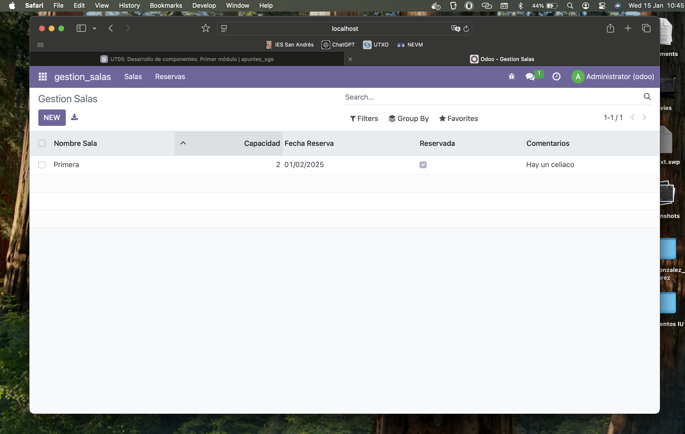

# PRO501: CREACIÓN DE UN MÓDULO BÁSICO

## Para la realización de esta actividad se han editado los siguientes archivos:

### Manifest (__manifest__.py):

```
# -*- coding: utf-8 -*-
{
    'name': "Gestion salas",

    'summary': """
        Módulo para la gestión de la reserva de salas""",

    'description': """
        Módulo para la gestión de la reserva de salas
    """,

    'author': "Javier González",
    'website': "https://javiergonzalez02.github.io/sge_jga/",

    # Categories can be used to filter modules in modules listing
    # Check https://github.com/odoo/odoo/blob/16.0/odoo/addons/base/data/ir_module_category_data.xml
    # for the full list
    'category': 'Uncategorized',
    'version': '0.1',
    'application': True,

    # any module necessary for this one to work correctly
    'depends': ['base'],

    # always loaded
    'data': [
        'security/ir.model.access.csv',
        'views/views.xml',
        'views/templates.xml',
    ],
    # only loaded in demonstration mode
    'demo': [
        'demo/demo.xml',
    ],
}
```

## Models.py:

```
# -*- coding: utf-8 -*-

from odoo import models, fields, api  # type: ignore


class gestion_salas(models.Model):
    _name = 'gestion_salas.gestion_salas'
    _description = 'gestion_salas.gestion_salas'

    nombre_sala = fields.Char()
    capacidad = fields.Integer()
    fecha_reserva = fields.Date()
    reservada = fields.Boolean()
    comentarios = fields.Text()
```

## Views.xml:

```
<odoo>
    <data>
        <!-- explicit list view definition -->

        <record model="ir.ui.view" id="gestion_salas.list">
            <field name="name">gestion_salas list</field>
            <field name="model">gestion_salas.gestion_salas</field>
            <field name="arch" type="xml">
                <tree>
                    <field name="nombre_sala"/>
                    <field name="capacidad"/>
                    <field name="fecha_reserva"/>
                    <field name="reservada"/>
                    <field name="comentarios"/>
                </tree>
            </field>
        </record>

        <!-- actions opening views on models -->

        <record model="ir.actions.act_window" id="gestion_salas.action_window">
            <field name="name">Gestion Salas</field>
            <field name="res_model">gestion_salas.gestion_salas</field>
            <field name="view_mode">tree,form</field>
        </record>


        <!-- Top menu item -->

        <menuitem name="gestion_salas" id="gestion_salas.menu_root"/>

        <!-- menu categories -->

        <menuitem name="Salas" id="gestion_salas.menu_1" parent="gestion_salas.menu_root"/>
        <menuitem name="Reservas" id="gestion_salas.menu_2" parent="gestion_salas.menu_root"/>

        <!-- actions -->

        <menuitem name="Salas" id="gestion_salas.menu_1_list" parent="gestion_salas.menu_1"
                  action="gestion_salas.action_window"/>
        <menuitem name="Nueva Reserva" id="gestion_salas.menu_2_list" parent="gestion_salas.menu_2"
                  action="gestion_salas.action_window"/>
    </data>
</odoo>
```

## Módulo funcionando tras estos cambios:

