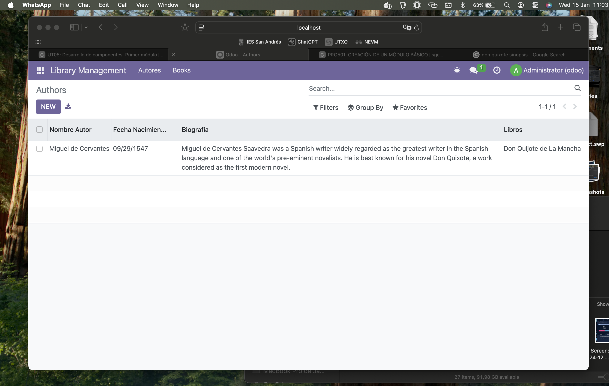
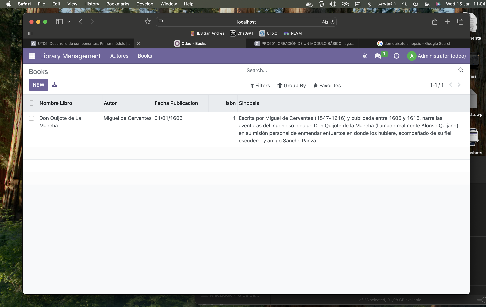

# PRO502: MÓDULO CON DOS MODELOS

## Para la realización de esta actividad se han editado los siguientes archivos:

### Manifest (__manifest__.py):

```
# -*- coding: utf-8 -*-
{
    'name': "Library Management",

    'summary': """
        Módulo para la gestión de una biblioteca""",

    'description': """
        Módulo para la gestión de una biblioteca
    """,

    'author': "Javier González",
    'website': "https://javiergonzalez02.github.io/sge_jga/",

    # Categories can be used to filter modules in modules listing
    # Check https://github.com/odoo/odoo/blob/16.0/odoo/addons/base/data/ir_module_category_data.xml
    # for the full list
    'category': 'Uncategorized',
    'application': True,
    'version': '0.1',

    # any module necessary for this one to work correctly
    'depends': ['base'],

    # always loaded
    'data': [
        'security/ir.model.access.csv',
        'views/views.xml'
    ]
}
```

## Models.py ha sido borrado y reemplazado por los siguientes archivos:

## library_author.py:

```
from odoo import models, fields, api # type: ignore


class library_author(models.Model):
    _name = 'library_management.library_author'
    _description = 'library_management.library_author'

    nombre_autor = fields.Text()
    fecha_nacimiento = fields.Date()
    biografia = fields.Text()
    libros = fields.Text()
```

## library_book.py:

```
from odoo import models, fields, api # type: ignore


class library_book(models.Model):
    _name = 'library_management.library_book'
    _description = 'library_management.library_book'

    nombre_libro = fields.Text()
    autor = fields.Char()
    fecha_publicacion = fields.Date()
    isbn = fields.Integer()
    sinopsis = fields.Text()
```

## Debido a que se ha cambiado la estructura de los modelos se ha cambiado el archivo models/__init__.py:

```
# -*- coding: utf-8 -*-

from . import library_author
from . import library_book
```

## Views.xml:

```
<odoo>
    <data>
        <record model="ir.ui.view" id="view_library_author_tree">
            <field name="name">library_author.tree</field>
            <field name="model">library_management.library_author</field>
            <field name="arch" type="xml">
                <tree string="Authors">
                    <field name="nombre_autor"/>
                    <field name="fecha_nacimiento"/>
                    <field name="biografia"/>
                    <field name="libros"/>
                </tree>
            </field>
        </record>

        <record model="ir.ui.view" id="view_library_book_tree">
            <field name="name">library_book.tree</field>
            <field name="model">library_management.library_book</field>
            <field name="arch" type="xml">
                <tree string="Books">
                    <field name="nombre_libro"/>
                    <field name="autor"/>
                    <field name="fecha_publicacion"/>
                    <field name="isbn"/>
                    <field name="sinopsis"/>
                </tree>
            </field>
        </record>

        <menuitem name="Library Management" id="library_management.menu_root"/>

        <menuitem name="Autores" id="library_management.menu_authors" parent="library_management.menu_root"/>

        <menuitem name="Books" id="library_management.menu_books" parent="library_management.menu_root"/>

        <record id="action_library_author" model="ir.actions.act_window">
            <field name="name">Authors</field>
            <field name="res_model">library_management.library_author</field>
            <field name="view_mode">tree,form</field>
        </record>

        <menuitem name="Authors" id="library_management.menu_authors_action" parent="library_management.menu_authors" action="action_library_author"/>

        <record id="action_library_book" model="ir.actions.act_window">
            <field name="name">Books</field>
            <field name="res_model">library_management.library_book</field>
            <field name="view_mode">tree,form</field>
        </record>

        <menuitem name="Books" id="library_management.menu_books_action" parent="library_management.menu_root" action="action_library_book"/>
    </data>
</odoo>
```

## Al haber editado los modelos, también se debe editar el archivo security/ir.model.access.csv:

```
id,name,model_id:id,group_id:id,perm_read,perm_write,perm_create,perm_unlink
access_library_management_library_author,library_management.library_author,model_library_management_library_author,base.group_user,1,1,1,1
access_library_management_library_book,library_management.library_book,model_library_management_library_book,base.group_user,1,1,1,1
```

## Módulo funcionando tras estos cambios:


