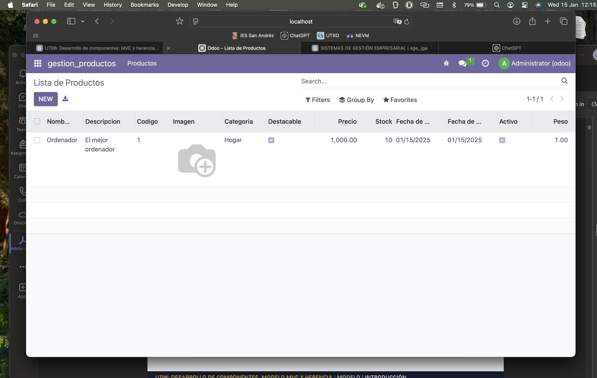

# PRO601: CAMPOS DEL MODELO

## Para la realización de esta actividad se han editado los siguientes archivos:

### Manifest (__manifest__.py):

```
# -*- coding: utf-8 -*-
{
    'name': "Gestión Productos",

    'summary': """
        Módulo para la gestión de productos""",

    'description': """
        Módulo para la gestión de productos
    """,

    'author': "Javier González",
    'website': "https://javiergonzalez02.github.io/sge_jga/",

    # Categories can be used to filter modules in modules listing
    # Check https://github.com/odoo/odoo/blob/16.0/odoo/addons/base/data/ir_module_category_data.xml
    # for the full list
    'category': 'Uncategorized',
    'application': True,
    'version': '0.1',

    # any module necessary for this one to work correctly
    'depends': ['base'],

    # always loaded
    'data': [
        'security/ir.model.access.csv',
        'views/views.xml'
    ],
    # only loaded in demonstration mode
    'demo': [
        'demo/demo.xml',
    ]
}
```

## Models.py:

```
# -*- coding: utf-8 -*-

from odoo import models, fields, api # type: ignore


class gestion_productos(models.Model):
    _name = 'gestion_productos.gestion_productos'
    _description = 'gestion_productos.gestion_productos'

    # Información básica
    nombre = fields.Char()
    descripcion = fields.Text()
    codigo = fields.Char(required=True)
    imagen = fields.Binary()

    # Categoría y tipo
    categoria = fields.Selection(
        selection=[
            ('Jardín', 'Jardín'),
            ('Hogar', 'Hogar'),
            ('Electrodomésticos', 'Electrodomésticos')
        ],
        required=True,
        default='Jardín'
    )
    tipo = fields.Boolean(string="Destacable")

    # Información económica
    precio = fields.Float()
    stock = fields.Integer()

    # Fecha y disponibilidad
    fecha_creacion = fields.Date(
        default=fields.Date.today,
        readonly=True,
        string="Fecha de Creación"
    )
    fecha_actualizacion = fields.Date(
        default=fields.Date.today,
        readonly=True,
        string="Fecha de Actualización"
    )

    # Información adicional
    activo = fields.Boolean(string="Activo", default=True)
    peso = fields.Float(digits=(16, 2))
```

## Views.xml:

```
<odoo>
    <data>
        <record model="ir.ui.view" id="gestion_productos.list">
            <field name="name">gestion_productos list</field>
            <field name="model">gestion_productos.gestion_productos</field>
            <field name="arch" type="xml">
                <tree>
                    <field name="nombre"/>
                    <field name="descripcion"/>
                    <field name="codigo"/>
                    <field name="imagen" widget="image" options="{'size': [100, 100]}"/>
                    <field name="categoria"/>
                    <field name="tipo"/>
                    <field name="precio"/>
                    <field name="stock"/>
                    <field name="fecha_creacion"/>
                    <field name="fecha_actualizacion"/>
                    <field name="activo"/>
                    <field name="peso"/>
                </tree>
            </field>
        </record>
        <record model="ir.actions.act_window" id="gestion_productos.action_window">
            <field name="name">Lista de Productos</field>
            <field name="res_model">gestion_productos.gestion_productos</field>
            <field name="view_mode">tree,form</field>
        </record>


        <menuitem name="gestion_productos" id="gestion_productos.menu_root"/>

        <menuitem name="Productos" id="gestion_productos.menu_1" parent="gestion_productos.menu_root"/>

        <menuitem name="Lista de productos" id="gestion_productos.menu_1_list" parent="gestion_productos.menu_1"
                  action="gestion_productos.action_window"/>

    </data>
</odoo>
```

## Módulo funcionando tras estos cambios:

