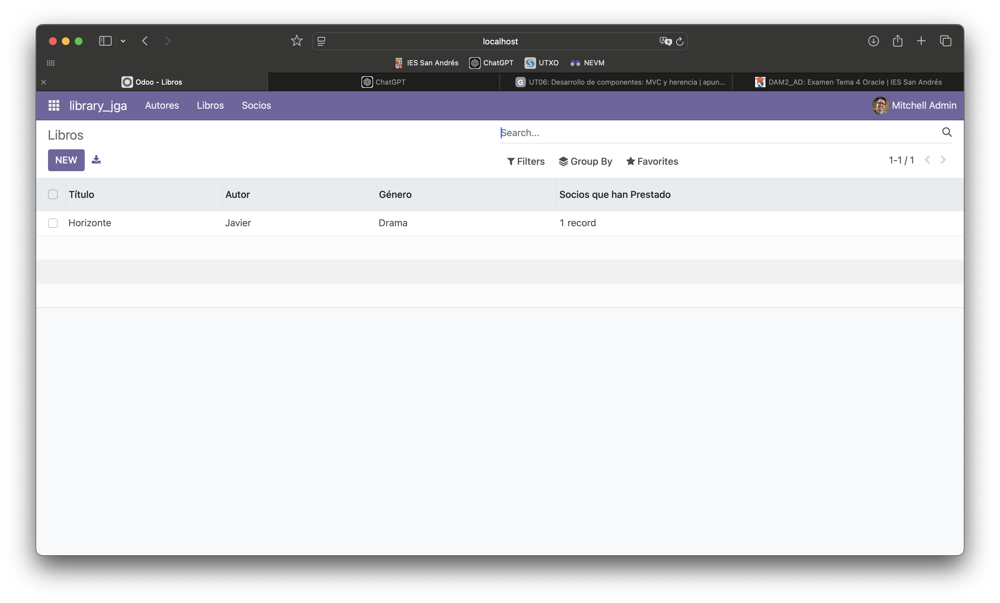

# PRO501: CREACIÓN DE UN MÓDULO BÁSICO

## Para la realización de esta actividad se han editado los siguientes archivos:

### Manifest (__manifest__.py):

```
# -*- coding: utf-8 -*-
{
    'name': "Library jga",

    'summary': """
        Módulo librería JGA""",

    'description': """
        Módulo librería JGA
                   """,

    'author': "Javier González",
    'website': "https://javiergonzalez02.github.io/sge_jga/",

    # Categories can be used to filter modules in modules listing
    # Check https://github.com/odoo/odoo/blob/16.0/odoo/addons/base/data/ir_module_category_data.xml
    # for the full list
    'category': 'Uncategorized',
    'version': '0.1',
    'application': True,

    # any module necessary for this one to work correctly
    'depends': ['base'],

    # always loaded
    'data': [
        'security/ir.model.access.csv',
        'views/library_autor_views.xml',
        'views/library_libro_views.xml',
        'views/library_socio_views.xml',
        'views/library_menu_views.xml',
        'views/templates.xml',
    ],
    # only loaded in demonstration mode
    'demo': [
        'demo/demo.xml',
    ],
}
```

## Modelos:

## autor.py:

```
# -*- coding: utf-8 -*-

from odoo import models, fields, api  # type: ignore

class Autor(models.Model):
    _name = 'library_jga.autor'
    _description = 'Autor de Libros'

    name = fields.Char(string='Nombre', required=True)
    country_id = fields.Many2one('res.country', string='País de Origen', required=True)
    libro_ids = fields.One2many('library_jga.libro', 'autor_id', string='Libros Escritos')
```

## libro.py:

```
from odoo import models, fields  # type: ignore

class Libro(models.Model):
    _name = 'library_jga.libro'
    _description = 'Libro de la Biblioteca'

    name = fields.Char(string='Título', required=True)
    autor_id = fields.Many2one('autores.autor', string='Autor', required=True)
    genero = fields.Selection([
        ('novela', 'Novela'),
        ('drama', 'Drama'),
        ('ciencia_ficcion', 'Ciencia Ficción'),
        ('misterio', 'Misterio'),
        ('terror', 'Terror'),
        ('historico', 'Histórico'),
    ], string='Género', required=True)
    socio_ids = fields.Many2many('socios.socio', string='Socios que han Prestado')
```

## socio.py:

```
**from odoo import models, fields  # type: ignore

class Socio(models.Model):
    _name = 'library_jga.socio'
    _description = 'Socio de la Biblioteca'

    name = fields.Char(string='Nombre', required=True)
    phone = fields.Char(string='Teléfono')
    libro_ids = fields.Many2many('library_jga.libro', string='Libros Prestados')**
```

## ir.model.access.csv:

```
id,name,model_id:id,group_id:id,perm_read,perm_write,perm_create,perm_unlink
access_library_jga_autor,library_jga.autor,model_library_jga_autor,base.group_user,1,1,1,1
access_library_jga_libro,library_jga.libro,model_library_jga_libro,base.group_user,1,1,1,1
access_library_jga_socio,library_jga.socio,model_library_jga_socio,base.group_user,1,1,1,1
```

## library_autor_views.xml:

```
<odoo>
    <data>
        <!-- explicit list view definition -->

        <record model="ir.ui.view" id="library_jga.list_autores">
            <field name="name">Autores</field>
            <field name="model">library_jga.autor</field>
            <field name="arch" type="xml">
                <tree>
                    <field name="name"/>
                </tree>
            </field>
        </record>

        <!-- actions opening views on models -->

        <record model="ir.actions.act_window" id="library_jga.autores_action_window">
            <field name="name">Autores</field>
            <field name="res_model">library_jga.autor</field>
            <field name="view_mode">tree,form</field>
        </record>

    </data>
</odoo>
```

## library_libro_views.xml:

```
<odoo>
    <data>
        <!-- explicit list view definition -->

        <record model="ir.ui.view" id="library_jga.list_libros">
            <field name="name">Libros</field>
            <field name="model">library_jga.libro</field>
            <field name="arch" type="xml">
                <tree>
                    <field name="name"/>
                </tree>
            </field>
        </record>

        <!-- actions opening views on models -->

        <record model="ir.actions.act_window" id="library_jga.libros_action_window">
            <field name="name">Libros</field>
            <field name="res_model">library_jga.libro</field>
            <field name="view_mode">tree,form</field>
        </record>

    </data>
</odoo>
```

## library_socio_views.xml:

```
<odoo>
    <data>
        <!-- explicit list view definition -->

        <record model="ir.ui.view" id="library_jga.list_socios">
            <field name="name">Socios</field>
            <field name="model">library_jga.socio</field>
            <field name="arch" type="xml">
                <tree>
                    <field name="name"/>
                </tree>
            </field>
        </record>

        <!-- actions opening views on models -->
        <record model="ir.actions.act_window" id="library_jga.socios_action_window">
            <field name="name">Socios</field>
            <field name="res_model">library_jga.socio</field>
            <field name="view_mode">tree,form</field>
        </record>

    </data>
</odoo>
```

## library_menu_views.xml:

```
<odoo>
    <data>
        <!-- Top menu item -->

        <menuitem name="library_jga" id="library_jga.menu_root"/>

        <!-- menu categories -->

        <menuitem name="Autores" id="library_jga.menu_autores" parent="library_jga.menu_root"/>
        <menuitem name="Libros" id="library_jga.menu_libros" parent="library_jga.menu_root"/>
        <menuitem name="Socios" id="library_jga.menu_socios" parent="library_jga.menu_root"/>

        <!-- actions -->

        <menuitem name="List" id="library_jga.menu_autores_list" parent="library_jga.menu_autores"
                  action="library_jga.autores_action_window"/>

        <menuitem name="List" id="library_jga.menu_libros_list" parent="library_jga.menu_libros"
                  action="library_jga.libros_action_window"/>

        <menuitem name="List" id="library_jga.menu_socios_list" parent="library_jga.menu_socios"
                  action="library_jga.socios_action_window"/>


    </data>
</odoo>
```

## Módulo funcionando tras estos cambios:



