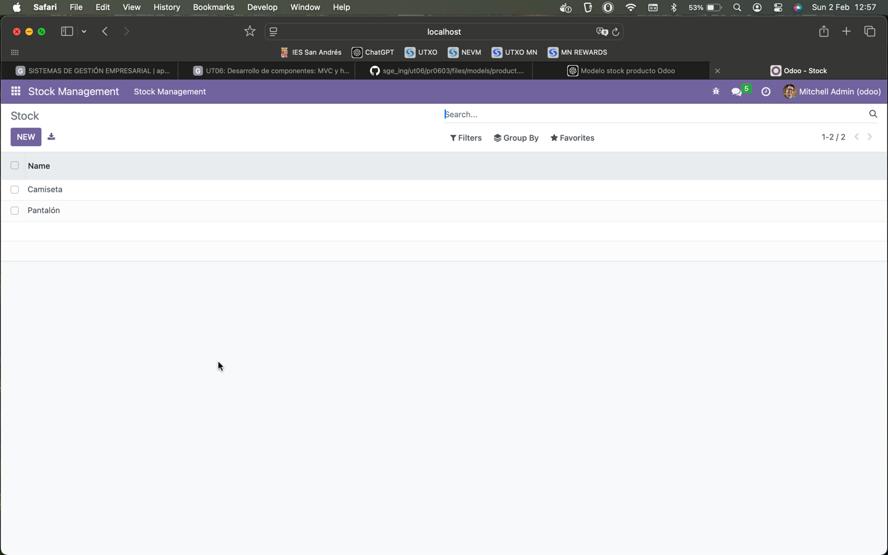

# PRO603: CAMPOS CALCULADOS Y RESTRICCIONES

## Para la realización de esta actividad se han editado los siguientes archivos:

## models.py:

```
#-*- coding: utf-8 -*-

from odoo import models, fields, api # type: ignore
from odoo.exceptions import ValidationError # type: ignore


class stock_management(models.Model):
    _name = 'stock_management.stock_management'
    _description = 'stock_management.stock_management'
    _sql_constraints = [
        ('unique_name', 'unique(name)', 'El nombre no se puede repetir'),
        ('min_quantity', 'CHECK(quantity > 0)', 'Debe haber al menos una unidad en stock')
    ]

    name = fields.Text()
    category = fields.Selection([
        ('comida', 'Comida'),
        ('ropa', 'Ropa'),
        ('mecánica', 'Mecánica'),
    ], string='Categoría', default=('comida'))
    price = fields.Float()
    quantity = fields.Integer()
    total_value = fields.Float(compute="_compute_total_value")
    minimum_quantity = fields.Integer()
    stock_status = fields.Selection([
        ('bajo', 'Bajo'),
        ('normal', 'Normal'),
    ], compute="_compute_stock_status", string='Estado del stock', readOnly=True)
    full_name = fields.Text(compute="_compute_full_name", readOnly=True)

    @api.depends('price', 'quantity')
    def _compute_total_value(self):
        for record in self:
            record.total_value = record.price * record.quantity

    @api.depends('quantity', 'minimum_quantity')
    def _compute_stock_status(self):
        for record in self:
            if record.quantity < record.minimum_quantity:
                record.stock_status = 'bajo'
            else:
                record.stock_status = 'normal'

    @api.depends('name', 'category')
    def _compute_full_name(self):
        for record in self:
            record.full_name = str(record.name) + ' (' + str(record.category) + ')'

    @api.constrains('price', 'quantity', 'total_value', 'category')
    def _check_constraints(self):
        for record in self:
            if record.price <= 0:
                raise ValidationError("El precio debe ser mayor que 0.")
            if record.quantity < 0:
                raise ValidationError("La cantidad debe ser mayor o igual a 0.")
            if record.total_value > 100000:
                raise ValidationError("El valor total del stock no puede superar las 100000 unidades monetarias.")
            if not record.category:
                raise ValidationError("El producto debe tener una categoría asignada.")
```

## ir.model.access.csv:

```
id,name,model_id:id,group_id:id,perm_read,perm_write,perm_create,perm_unlink
access_stock_management_stock_management,stock.stock_management,model_stock_management_stock_management,base.group_user,1,1,1,1
```


## views.xml:

```
<odoo>
    <data>
        <!-- Action for Stock List -->
        <record id="stock_management_list" model="ir.actions.act_window">
            <field name="name">Stock</field>
            <field name="res_model">stock_management.stock_management</field>
            <field name="view_mode">tree,form</field>
        </record>

        <!-- Top menu item -->
        <menuitem name="Stock Management" id="stock_management.menu_root"/>

        <!-- menu categories -->
        <menuitem name="Stock Management" id="stock_management_menu_1" parent="stock_management.menu_root"/>
        <!-- actions -->
        <menuitem name="Stock" id="stock_management.menu_1_list" parent="stock_management_menu_1"
                  action="stock_management_list"/>
    </data>
</odoo>
```

## Módulo funcionando tras estos cambios:

