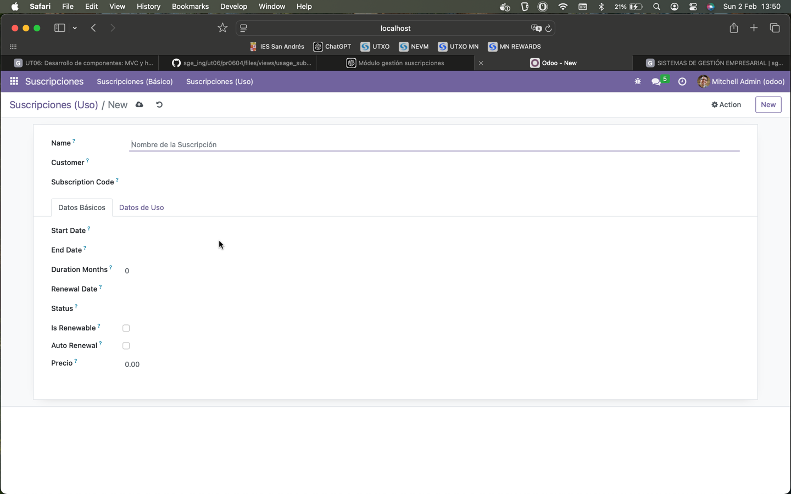
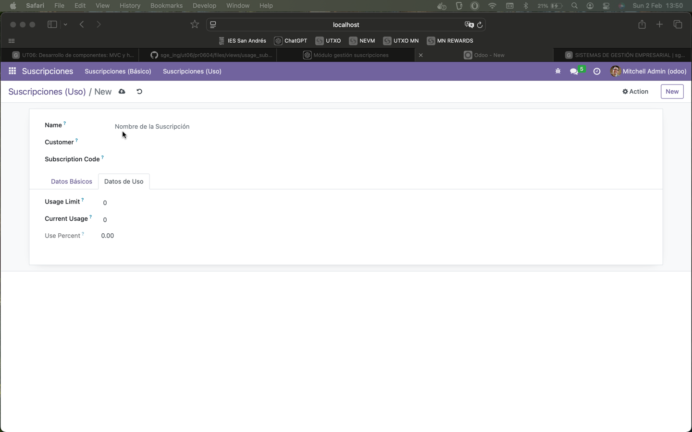

# PRO604: VISTA DE TIPO FORMULARIO

## Para la realización de esta actividad se han editado los siguientes archivos:


## views.xml:

```
<odoo>
    <data>
        <!-- Vista de lista básica -->
        <record model="ir.ui.view" id="view_subscription_tree_basic">
            <field name="name">subscription.tree.basic</field>
            <field name="model">subscription.subscription</field>
            <field name="arch" type="xml">
                <tree string="Suscripciones (Básico)" limit="15"
                      decoration-danger="status == 'expired'"
                      decoration-warning="status == 'cancelled'">
                    <field name="name" string="Nombre"/>
                    <field name="customer_id" string="Cliente"/>
                    <field name="subscription_code" string="Código"/>
                    <field name="start_date" string="Inicio"/>
                    <field name="end_date" string="Fin" widget="remaining_days"/>
                    <field name="duration_months" string="Duración (meses)"/>
                    <field name="renewal_date" string="Renovación"/>
                    <field name="status" string="Estado"/>
                    <field name="is_renewable" string="Renovable"/>
                    <field name="auto_renewal" string="Renovación Automática"/>
                    <field name="price" string="Precio" attrs="{'invisible': [('status', '=', 'cancelled')]}"/>
                    <button name="action_add_15_days" string="Añadir 15 Días" type="object" class="btn-primary"/>
                </tree>
            </field>
        </record>

        <!-- Vista de lista de uso -->
        <record id="view_subscription_tree_usage" model="ir.ui.view">
            <field name="name">subscription.tree.usage</field>
            <field name="model">subscription.subscription</field>
            <field name="arch" type="xml">
                <tree string="Suscripciones (Uso)" limit="15">
                    <field name="name" string="Nombre"/>
                    <field name="usage_limit" string="Límite de Uso"/>
                    <field name="current_usage" string="Uso Actual"/>
                    <field name="use_percent" string="Porcentaje de Uso" decoration-danger="use_percent > 80" avg="1"
                           widget="progressbar"/>
                </tree>
            </field>
        </record>

        <!-- Vista formulario -->
        <record id="view_subscription_form_custom" model="ir.ui.view">
            <field name="name">subscription.subscription.form.custom</field>
            <field name="model">subscription.subscription</field>
            <field name="arch" type="xml">
                <form string="Suscripción">
                    <sheet>
                        <group>
                            <field name="name" placeholder="Nombre de la Suscripción"/>
                            <field name="customer_id"/>
                            <field name="subscription_code"/>
                        </group>

                        <notebook>
                            <page string="Datos Básicos">
                                <group>
                                    <field name="start_date"/>
                                    <field name="end_date" widget="remaining_days"/>
                                    <field name="duration_months"/>
                                    <field name="renewal_date"/>
                                    <field name="status"/>
                                    <field name="is_renewable"/>
                                    <field name="auto_renewal"/>
                                    <field name="price" attrs="{'invisible': [('status', '=', 'cancelled')]}"/>
                                </group>
                            </page>

                            <page string="Datos de Uso">
                                <group>
                                    <field name="usage_limit"/>
                                    <field name="current_usage"/>
                                    <field name="use_percent"/>
                                </group>
                            </page>
                        </notebook>
                    </sheet>
                </form>
            </field>
        </record>


        <!-- actions opening views on models -->

        <record id="action_subscription_basic" model="ir.actions.act_window">
            <field name="name">Suscripciones (Básico)</field>
            <field name="res_model">subscription.subscription</field>
            <field name="view_mode">tree,form</field>
            <field name="view_id" ref="view_subscription_tree_basic"/>
            <field name="views" eval="[
                (ref('view_subscription_tree_basic'), 'tree'),
                (ref('view_subscription_form_custom'), 'form')
            ]"/>
        </record>

        <record id="action_subscription_usage" model="ir.actions.act_window">
            <field name="name">Suscripciones (Uso)</field>
            <field name="res_model">subscription.subscription</field>
            <field name="view_mode">tree,form</field>
            <field name="view_id" ref="view_subscription_tree_usage"/>
            <field name="views" eval="[
                (ref('view_subscription_tree_usage'), 'tree'),
                (ref('view_subscription_form_custom'), 'form')
            ]"/>
        </record>

        <!-- Top menu item -->
        <menuitem id="menu_subscription_root" name="Suscripciones"/>
        <menuitem id="menu_subscription_basic" parent="menu_subscription_root" action="action_subscription_basic"/>
        <menuitem id="menu_subscription_usage" parent="menu_subscription_root" action="action_subscription_usage"/>
    </data>
</odoo>
```

## Módulo funcionando tras estos cambios:


