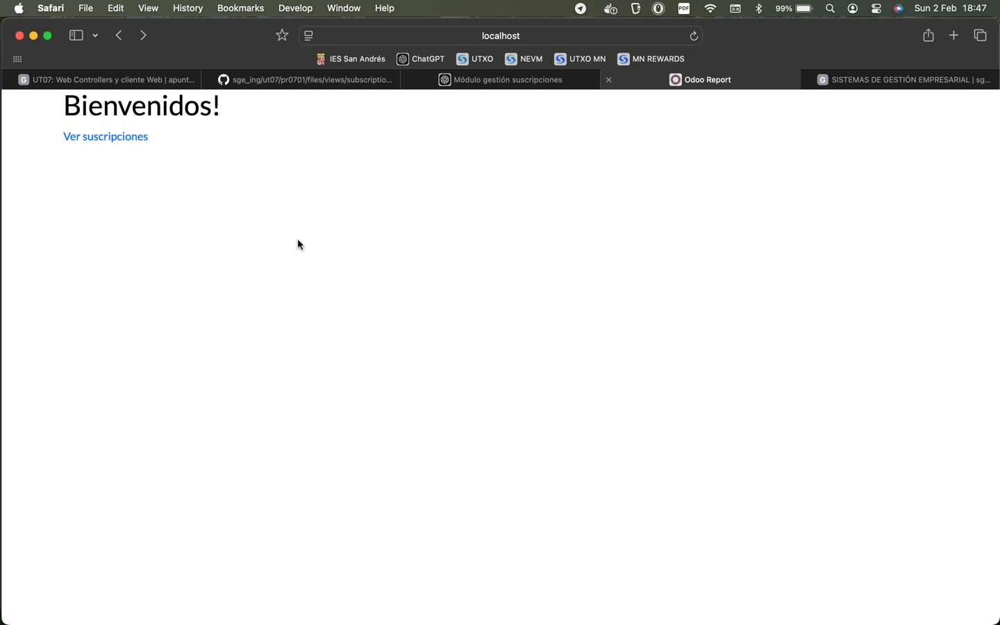
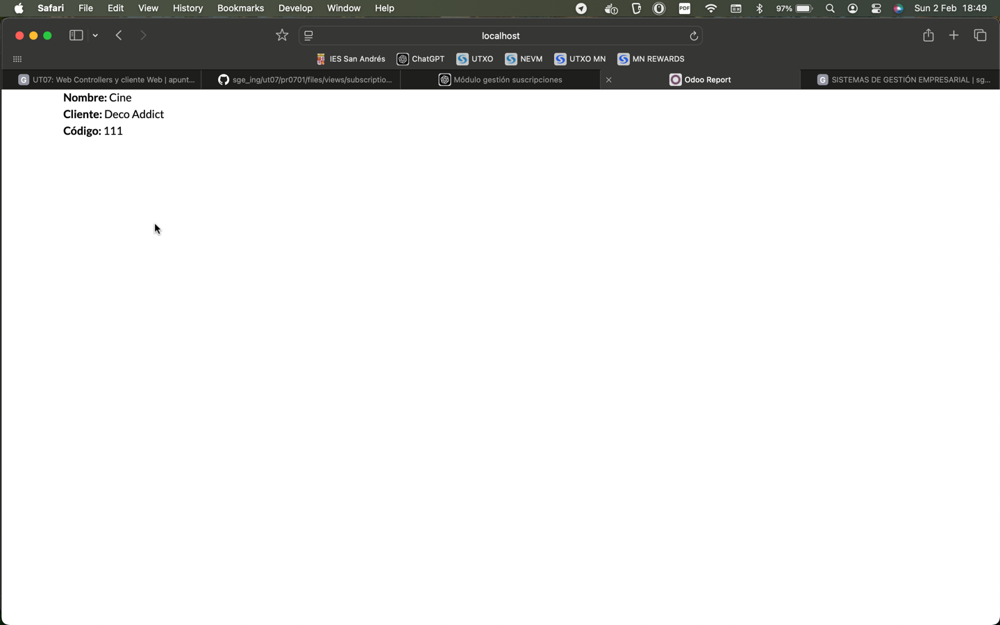

# PRO701: WEB CONTROLLERS Y CLIENTE WEB

## Para la realización de esta actividad se han editado los siguientes archivos:

## controllers.py:

```
# -*- coding: utf-8 -*-
from odoo import http #type: ignore
from odoo.http import request #type: ignore

class SubscriptionController(http.Controller):
    @http.route('/subscription/', auth='public', type='http', website=True)
    def welcome(self, **kwargs):
        return request.render('subscription.welcome_message_web', {})

    @http.route('/subscription/subscription_list', auth='public', type='http', website=True)
    def subscription_list_web(self, **kwargs):
        subscriptions = request.env['subscription.subscription'].sudo().search([])
        return request.render('subscription.subscription_list_web', {
            'subscriptions': subscriptions
        })
```

## welcome_message_web.xml:

```
<odoo>
    <template id="welcome_message_web" name="Mensaje de Bienvenida">
        <t t-call="web.html_container">
            <div class="container">
                <h1>Bienvenidos!</h1>
                <a href="./subscription_list">Ver suscripciones</a>
            </div>
        </t>
    </template>
</odoo>
```

## subscription_list_web.xml:

```
<odoo>
    <template id="subscription_list_web">
        <t t-call="web.html_container">
            <div class="container">
               <t t-foreach="subscriptions" t-as="subscription">
                   <div class="subscription">
                      <strong>Nombre:</strong> <span t-esc="subscription.name"/><br/>
                       <strong>Cliente:</strong> <span t-esc="subscription.customer_id.name"/><br/>
                       <strong>Código:</strong> <span t-esc="subscription.subscription_code"/>
                   </div>
               </t>
            </div>
        </t>
    </template>
</odoo>
```

## manifest.py:

```
# -*- coding: utf-8 -*-
{
    'name': "subscription",

    'summary': """
    Gestionar Suscripciones""",

    'description': """
        Gestionar Suscripciones
    """,

    'author': "Javier",
    'website': "https://www.yourcompany.com",

    # Categories can be used to filter modules in modules listing
    # Check https://github.com/odoo/odoo/blob/16.0/odoo/addons/base/data/ir_module_category_data.xml
    # for the full list
    'category': 'Uncategorized',
    'version': '0.1',

    # any module necessary for this one to work correctly
    'depends': ['base'],

    # always loaded
    'data': [
        'security/ir.model.access.csv',
        'views/views.xml',
        'views/templates.xml',
        'views/welcome_message_web.xml',
        'views/subscription_list_web.xml'
    ],
    # only loaded in demonstration mode
    'demo': [
        'demo/demo.xml',
    ],
}
```

## Módulo funcionando tras estos cambios:


