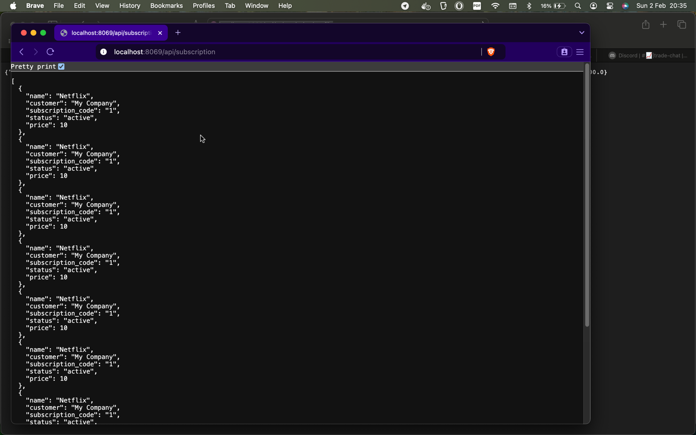
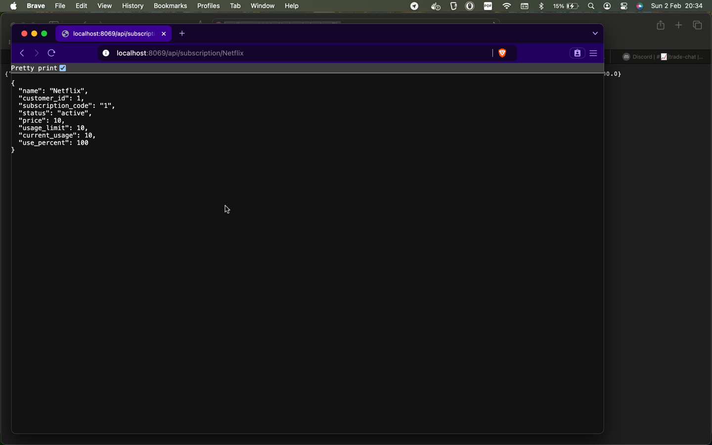

# PRO701: WEB CONTROLLERS Y CLIENTE WEB

## Para la realización de esta actividad se han editado los siguientes archivos:

## controllers.py:

```
# -*- coding: utf-8 -*-
from odoo import http  # type: ignore
from odoo.http import request, Response  # type: ignore
import json


class SubscriptionController(http.Controller):
    @http.route('/subscription/', auth='public', type='http', website=True)
    def welcome(self, **kwargs):
        return request.render('subscription.welcome_message_web', {})

    @http.route('/subscription/subscription_list', auth='public', type='http', website=True)
    def subscription_list_web(self, **kwargs):
        subscriptions = request.env['subscription.subscription'].sudo().search([])
        return request.render('subscription.subscription_list_web', {
            'subscriptions': subscriptions
        })

    @http.route('/api/subscription', auth='public', type="http", methods=['GET'], csrf=False)
    def api_get_subscriptions(self, **kwargs):
        # Obtiene el parámetro 'status'
        status = request.params.get('status')
        allowed_statuses = ['active', 'expired', 'pending', 'cancelled']

        if status and status not in allowed_statuses:
            return Response(
                json.dumps({
                    "error": "Bad request, invalid status. Allowed values: active, expired, pending, cancelled."}),
                status=400,
                content_type='application/json'
            )

        domain = []
        if status:
            domain.append(('status', '=', status))

        subscriptions = request.env['subscription.subscription'].sudo().search(domain)

        subscriptions_list = []
        for sub in subscriptions:
            subscriptions_list.append({
                'name': sub.name,
                'customer': sub.customer_id.name,
                'subscription_code': sub.subscription_code,
                'status': sub.status,
                'price': sub.price,
            })

        return Response(
            json.dumps(subscriptions_list),
            status=200,
            content_type='application/json'
        )


    @http.route('/api/subscription/<string:name>', auth='public', type='http', methods=['GET'], csrf=False)
    def api_get_subscription(self, name, **kwargs):
        subscription = request.env['subscription.subscription'].sudo().search([('name', '=', name)], limit=1)
        if not subscription:
            return Response(
                json.dumps({"error": "No se encontró la suscripción con el nombre '{}'.".format(name)}),
                status=404,
                content_type='application/json'
            )

        subscription_data = {
            'name': subscription.name,
            'customer_id': subscription.customer_id.id,
            'subscription_code': subscription.subscription_code,
            'status': subscription.status,
            'price': subscription.price,
            'usage_limit': subscription.usage_limit,
            'current_usage': subscription.current_usage,
            'use_percent': subscription.use_percent,
        }

        return Response(
            json.dumps(subscription_data),
            status=200,
            content_type='application/json'
        )
```

## Módulo funcionando tras estos cambios:


